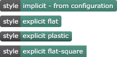
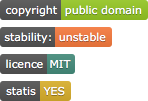
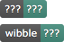

# Kirby3 badges

   [](https://github.com/omz13/kirby3-badges/issues)

**Requirement:** Kirby 3

## Documentation

### Purpose

For a [Kirby3](https://getkirby.com)-powered site, this plugin (_omz13/badges_) provides a KirbyTag (called `badge`) that allows badges to be rendered in a page.

- This plugin is a convenience wrapper around [PHP Badges Library](https://github.com/badges/poser).
- No configuration is really necessary as it comes with sensible defaults.
- The render style can be specified in the configuration file and overridden on a per tag basis.
- The color for the value can be specified in the configuration file and overridden on a per tag basis.
- There are sensible defaults if you forget to provide the necessary key and/or value data in a tag.
- The badge is rendered locally, provided as a SVG image, and wrapped in a `<div>` with an optional `class`.

#### Caveat

Kirby3 is under beta, therefore this plugin, and indeed kirby3 itself, may or may not play nicely with each other, or indeed work at all: use it for testing purposes only; if you use it in production then you should be aware of the risks and know what you are doing.

#### Roadmap

For 1.0, the non-binding list of further features and implementation notes are:

- [ ] Wait for Kirby3 GA
- [ ] Page-level function

### Installation

#### via composer

If your kirby3-based site is managed using-composer, simply invoke `composer require --no-dev omz13/kirby3-badges`, or add `omz13/kirby3-badges` to the "require" component of your site's `composer.json` as necessary, e.g. to be on the bleeding-edge:

```yaml
"require": {
  ...
  "omz13/kirby3-badges": "@dev",
  ...
}
```

#### via git

Clone github.com/omz13/kirby3-badges into your `site/plugins` and then in `site/plugins/kirby3-badges` invoke ``composer update --no-dev`` to generate the `vendor` folder and the magic within.

```sh
$ git clone github.com/omz13/kirby3-badges site/plugins/kirby3-badges
$ cd site/plugins/kirby3-badges
$ composer update --no-dev
```

If your project itself is under git, then you need to add the plugin as a submodule and possibly automate the composer update; it is assumed if you are doing this that you know what to do.

#### via zip

So you want everything in a zip file you can simply expand into `site/plugins/kirby3-badges`? Not yet. Sorry.

### Configuration

The following mechanisms can be used to modify the plugin's behaviour.

#### via `config.php`

In your site's `site/config/config.php` the following entries prefixed with `omz13.badges.` can be used:

- `style` - optional - the name of the rendering style to apply.

  Possible values are:
    - `flat` (default if not specified)
    - `flat-square`
    - `plastic`

- `color` - optional - the name or RGBHEX value to be used for the badge's name.

  If not specified, `428F7E` is assumed.

- `class` - optional - the code for the badge will be wrapped in a `<DIV>` with a _classname_ specified here.

  If not specified, the `<DIV>` wrapper has no class.

For example:

```php
<?php

return [
  'omz13.badges.style' => 'plastic',
  'omz13.badges.class' => 'badge',
  ],
];
```

## Use

```
"(badge:" key value [ color [ "style:"style ] ] ")"
```

When writing content, this plugin provide a new tag, `badge`, which has two mandatory parameters that specify the `key` and `value` for the badge; an optional third parameter specifies the color for the value, either as a named color (e.g. `red`) or a RGBhex (e.g. `428F7E`).

An optional attribute of `style` can be used to override the default style (c.f. `style` in _Configuration_).

Parameters can be separated by spaces (` `), commas (`,`), or semicolons (`;`).

If `key` is not supplied, then `???` will be used.

If `value` is not supplied, then `???` will be used.

### Examples:

Use the (implicit) style from the configuration, or explictly set:

```
  - (badge: style, implicit - from configuration)
  - (badge: style, explicit flat style:flat)
  - (badge: style, explicit plastic style:plastic)
  - (badge: style, explicit flat-square style:flat-square)
```



Applying some color:

```
- (badge: copyright ; public domain ; green  )
- (badge: stability: unstable orange)
- (badge: licence MIT)
- (badge: statis YES yellow)
```



Missing key and/or value:

```
- (badge:)
- (badge: wibble)
```



## Disclaimer

This plugin is provided "as is" with no guarantee. Use it at your own risk and always test it yourself before using it in a production environment. If you find any issues, please [create a new issue](https://github.com/omz13/kirby3-badges/issues/new).

## License

[MIT](https://opensource.org/licenses/MIT)

You are prohibited from using this plugin in any project that promotes racism, sexism, homophobia, animal abuse, violence or any other form of hate speech.

### Buy Me A Coffee

To show your support for this project you are welcome to [buy me a coffee](https://buymeacoff.ee/omz13).

<!-- If you are using this plugin on a kirby3 site that has a Personal licence, to show your support for this project you are welcome to [buy me a coffee](https://buymeacoff.ee/omz13).

If you are using this plugin with a kirby3 site that has a Pro licence, to show your support for this project you are greatly encouraged to [buy me a coffee](https://buymeacoff.ee/omz13).
-->
